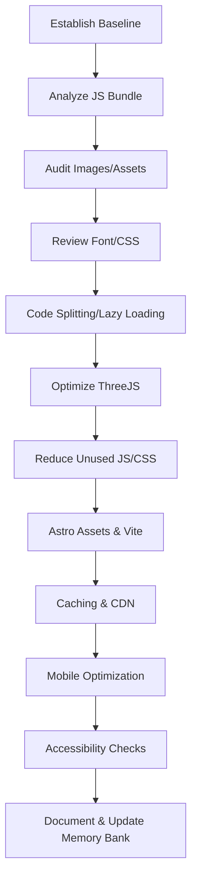

# Lighthouse Performance Optimization Plan (2025)

**Project:** Personal Portfolio Website (Astro, React, ThreeJS)  
**Date:** 2025-04-15  
**Prepared by:** Roo (AI Architect)  
**Baseline:** Desktop Lighthouse Audit (FCP: 4.1s, LCP: 7.7s, TBT: 0ms, CLS: 0, Network Payload: 8.5MB+)

---

## Executive Summary

This plan addresses critical performance issues identified in the latest Lighthouse audit, with a focus on reducing JS bundle size, improving LCP/FCP, optimizing assets, and ensuring best-in-class scores for both desktop and mobile.

---

## 12-Step Optimization Plan

### 1. Establish Baseline
- Run Lighthouse audits (Desktop & Mobile) for homepage and projects page.
- Document: LCP, FCP, TBT, CLS, JS bundle size, image sizes, unused JS/CSS.
- **Current Baseline:**  
  - FCP: 4.1s  
  - LCP: 7.7s (92% load delay)  
  - TBT: 0ms  
  - CLS: 0  
  - Network Payload: 8,533 KiB  
  - Largest JS: `@react-three_drei.js` (3.7MB), several other chunks >500KB  
  - Images: Not in next-gen formats, some oversized  
  - Text compression: Not enabled locally  
  - Unused JS/CSS: 5MB+ potential savings  
  - Animations: Some not composited  
  - Accessibility, Best Practices, SEO: 96-100

---

### 2. Analyze JS Bundle Composition & Hydration
- Use Vite/Bundle Analyzer to break down main JS bundles.
- Identify heavy Astro Islands, React components, and libraries.
- Pinpoint unnecessary hydration and large dependencies.

---

### 3. Audit Image & Asset Optimization
- Review all images (thumbnails, textures) for:
  - Format (prefer AVIF/WebP)
  - Sizing (no larger than display)
  - Delivery (Astro Assets, responsive `srcset`)
- Optimize all images for quality and performance.

---

### 4. Review Font & CSS Delivery
- Ensure all fonts are self-hosted, WOFF2, `font-display: swap`.
- Audit CSS for unused rules (Tailwind Purge, minimal global CSS).
- Eliminate render-blocking CSS or font requests.

---

### 5. Implement Code Splitting & Lazy Loading
- Refactor React islands and ThreeJS components to load only when needed (`client:visible`, dynamic imports).
- Split large components (e.g., ThreeCanvas, ProjectFilters) into smaller, on-demand chunks.

---

### 6. Optimize ThreeJS Initialization
- Defer ThreeJS/3D code until after main content is visible.
- Use `requestIdleCallback` or similar to delay non-critical 3D effects.
- Profile and minimize main thread impact.

---

### 7. Reduce Unused JS/CSS
- Remove or split out code not needed on initial load (legacy scripts, dev utilities).
- Use Vite’s tree-shaking and Astro’s partial hydration to minimize shipped code.

---

### 8. Leverage Astro Assets & Vite Optimizations
- Route all static assets through Astro’s asset pipeline for hashing, compression, CDN delivery.
- Enable Vite’s advanced optimizations (preload, prefetch, minification).

---

### 9. Enhance Caching & CDN Strategies
- Set optimal cache headers for static assets and HTML in Vercel config.
- Use Brotli/gzip compression and edge caching for critical resources.
- Ensure text compression is enabled in all environments.

---

### 10. Test & Optimize for Mobile
- Re-run Lighthouse on mobile, focusing on TBT, LCP, and FCP.
- Use Chrome DevTools to simulate slow networks/devices.
- Address mobile-specific bottlenecks (touch delays, large images).

---

### 11. Accessibility & Progressive Enhancement Checks
- Run accessibility audits (Lighthouse, axe-core).
- Test keyboard navigation, color contrast, screen reader support.
- Ensure all core content is accessible without JS.

---

### 12. Document Changes & Update Memory Bank
- Record all optimizations, new patterns, and lessons learned in `progress.md`, `activeContext.md`, and `.clinerules`.
- Update documentation for future maintainers.

---

## Visual Plan

---

## References

- [Achieving a Perfect Lighthouse Score with Astro (Medium)](https://medium.com/@nicholassanti/achieving-a-perfect-lighthouse-score-with-astro-612a20e10061)
- [Kontent.ai: Minimize JavaScript usage](https://kontent.ai/blog/site-performance-tips-lighthouse-score/)
- [Astro.js Performance Optimization (TillItsDone)](https://tillitsdone.com/blogs/astro-js-performance-optimization/)
- [DebugBear: Lighthouse Performance Metrics](https://www.debugbear.com/docs/metrics/lighthouse-performance)
- [LinearLoop: Avoid Unnecessary Script Imports](https://www.linearloop.io/blog/google-lighthouse-score-100)

---

**Next Step:**  
Switch to code mode to begin implementation of this plan.