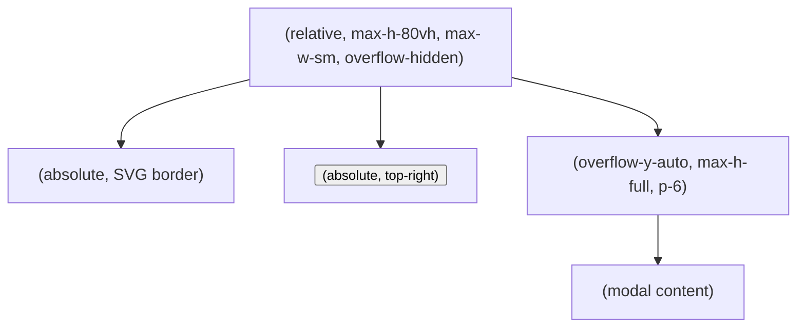

# Modal Scrollability & Animated Border Confinement Plan

## Objective

Make the modal popups (triggered by project cards) scrollable, ensuring all information in the popup stays visually confined within the animated border, regardless of content length or viewport size.

---

## 1. Modal Structure Overview

- **Modal Container**: `relative`, `max-h-[80vh]`, `max-w-sm`, `overflow-hidden`, `rounded-2xl`
- **Animated Border**: Absolutely positioned SVG (via `AnimatedBorder.jsx`), overlays modal content, `pointer-events-none`
- **Scrollable Content**: `overflow-y-auto`, `max-h-full`, `p-6` (padding ensures content does not touch border)
- **Close Button**: Absolutely positioned, always visible

---

## 2. Best Practice References

- [CSS-Tricks: Animating Borders](https://css-tricks.com/animating-border/)
- [MDN: overflow](https://developer.mozilla.org/en-US/docs/Web/CSS/overflow)
- [StackOverflow: scrollable modal with border](https://stackoverflow.com/questions/32621988/how-to-make-a-modal-scrollable-with-a-border)
- [Tailwind Docs: overflow, max-height, padding](https://tailwindcss.com/docs/overflow)

**Key points:**
- The border should be absolutely positioned and `pointer-events-none`.
- The scrollable area should be inside the border, with padding to prevent overlap.
- The modal container should have a fixed `max-height` (e.g., `80vh`) and width.
- The scrollable content should have `overflow-y-auto` and `max-h-full`.

---

## 3. Implementation Steps

### a. Padding
- Ensure the scrollable content (`div.overflow-y-auto`) has sufficient padding (e.g., `p-6`) so content does not touch the border.

### b. Sizing
- Modal container: `max-h-[80vh]`, `max-w-sm` (or responsive values).
- Scrollable content: `max-h-full`, `overflow-y-auto`.

### c. Border
- `AnimatedBorder` SVG: `width="100%" height="100%"`, absolutely positioned, `inset-0`, `pointer-events-none`.
- Consider `strokeWidth` when setting content padding.

### d. Accessibility
- Ensure keyboard navigation and focus trapping are preserved.
- Close button remains visible and accessible at all times.

### e. Optional: Custom Scrollbar
- For visual polish, add a custom scrollbar style (using Tailwind or custom CSS).

### f. Testing
- Test with long content to ensure scrolling works and the border remains fixed.
- Test on various screen sizes (desktop, tablet, mobile).
- Test keyboard navigation and screen reader accessibility.

---

## 4. Mermaid Diagram

---

## 5. Summary Table

| Element            | CSS/Props                        | Purpose                                 |
|--------------------|----------------------------------|-----------------------------------------|
| Modal Container    | relative, max-h-80vh, overflow-hidden | Holds border and content, sets bounds   |
| AnimatedBorder     | absolute, inset-0, pointer-events-none | Animated SVG border, overlays content   |
| Scrollable Content | overflow-y-auto, max-h-full, p-6 | Scrolls if content overflows, padded    |
| Close Button       | absolute, top-4 right-4          | Always visible, accessible              |

---

## 6. Notes

- The current implementation already follows most best practices for scrollable modals with animated borders.
- If content ever overlaps the border, increase padding or adjust `strokeWidth`.
- For accessibility, ensure focus is trapped within the modal and the close button is keyboard-accessible.

---

## References

- [CSS-Tricks: Animating Borders](https://css-tricks.com/animating-border/)
- [MDN: overflow](https://developer.mozilla.org/en-US/docs/Web/CSS/overflow)
- [StackOverflow: scrollable modal with border](https://stackoverflow.com/questions/32621988/how-to-make-a-modal-scrollable-with-a-border)
- [Tailwind Docs: overflow, max-height, padding](https://tailwindcss.com/docs/overflow)