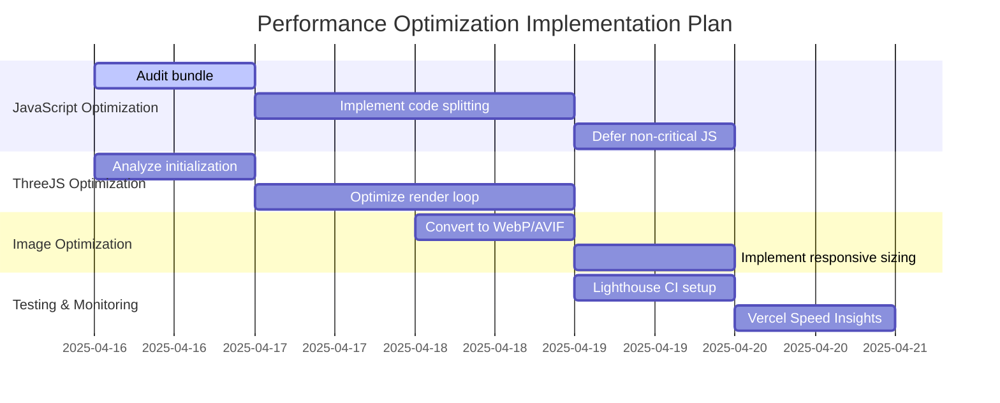

# Performance Optimization Implementation Plan

Based on PERFORMANCE_OPTIMIZATION.md (2025-04-15 Lighthouse Score: 83)

## Implementation Roadmap

## Detailed Implementation Steps

### 1. JavaScript Bundle Optimization
- **Target File:** `extends.CIQnLglx.js` (228KB)
- **Tasks:**
  - [ ] Audit bundle for unused code
  - [ ] Implement route-based code splitting
  - [ ] Defer non-critical JavaScript loading
  - [ ] Set up bundle size monitoring

### 2. ThreeJS Improvements
- **Target Components:** `ThreeCanvas.jsx`, `ThreeScene.astro`
- **Tasks:**
  - [ ] Analyze initialization sequence
  - [ ] Optimize render loop performance
  - [ ] Implement lazy loading for 3D assets
  - [ ] Add performance monitoring hooks

### 3. Image Optimization
- **Target Files:**
  - `public/textures/particle.png` (64KB → ~18KB)
  - `public/textures/mail.png` (5KB → ~1KB)
- **Tasks:**
  - [ ] Convert to WebP/AVIF format
  - [ ] Implement responsive image sizing
  - [ ] Add proper width/height attributes
  - [ ] Set up image CDN if needed

### 4. Testing & Monitoring
- **Tasks:**
  - [ ] Set up Lighthouse CI
  - [ ] Configure Vercel Speed Insights
  - [ ] Establish performance budget
  - [ ] Create regression test suite

## Success Metrics
- Target Lighthouse score: ≥95
- Expected FCP improvement: ~790ms
- Expected LCP improvement: ~3.15s
- Expected bundle size reduction: 139KB