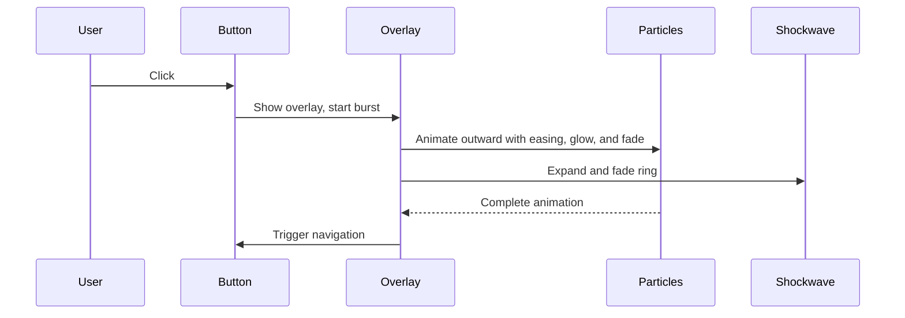

# Particle Burst Modernization Plan

## 1. Research & Inspiration

- Use modern particle burst inspiration from [Codrops Interactive Particles with Three.js](https://tympanus.net/codrops/2019/01/17/interactive-particles-with-three-js/), [mo.js Burst](https://mojs.github.io/tutorials/burst/), and [Three.js Examples](https://threejs.org/examples/).
- Key trends: additive blending/glow, non-uniform shapes, easing/spring motion, on-brand gradients, and shockwave overlays.

## 2. Design Goals

- Match your site's accent blue, gold, and purple, with gradients and glow.
- Use burst patterns that feel like a "power-up" or "level-up" effect.
- Animate with easing/spring, not linear, and add polish (glow, blur, optional sound).

## 3. Technical Steps

### A. Particle System Redesign

- Update color palette to your brand colors.
- Use Three.js AdditiveBlending and a soft-edged PNG texture for glow.
- Animate with cubic/spring easing, randomize speed/direction, and stagger start times.
- Mix in different shapes (circles, squares, triangles) via textures.
- Add a shockwave ring expanding with the burst.

### B. Implementation Steps

- Refactor the COLORS array in `TransitionOverlay.jsx`.
- Load and use a custom particle texture.
- Use an easing function for burst radius.
- Store per-particle random properties for motion.
- Add a ring geometry for the shockwave.
- Tune for performance and visual appeal.

## 4. Flow Diagram

## 5. References

- [Codrops Interactive Particles](https://tympanus.net/codrops/2019/01/17/interactive-particles-with-three-js/)
- [Three.js Particle Examples](https://threejs.org/examples/#webgl_points_billboards)
- [Easing Functions](https://easings.net/)
- [mo.js Burst](https://mojs.github.io/tutorials/burst/)

## 6. Next Steps

- Confirm if you want a code breakdown, a visual mockup, or further adjustments.
- Decide if you want sound/haptic feedback or a full-screen vs. button-area burst.