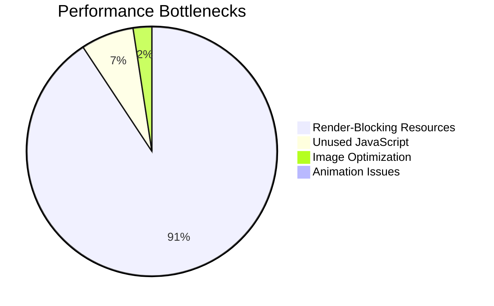
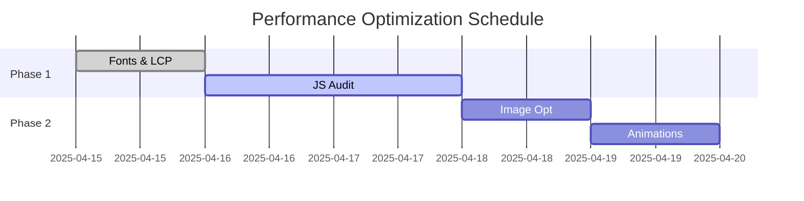

# Performance Optimization Plan for Mobile

Based on Lighthouse report from 2025-04-15 (Score: 83)

## Compression Implementation (Completed)
- [x] Configured Vercel automatic Brotli/gzip compression
- [x] Set optimal caching headers for static assets
- [x] Added vercel.json configuration

## Current Issues Summary

## Optimization Strategies

### 1. Font Optimization (High Impact)
- [x] Self-host Google Fonts (WOFF2 format)
- [ ] Implement font-display: swap
- [ ] Preload critical fonts
- **Expected Improvement**: ~790ms FCP reduction

### 2. LCP Optimization (Critical)
- [ ] Add `fetchpriority="high"` to LCP image
- [ ] Preload LCP image
- [ ] Optimize ThreeJS initialization
- **Expected Improvement**: ~3.15s render delay reduction

### 3. JavaScript Optimization (High Impact)

- [ ] Audit 228KB bundle (`extends.CIQnLglx.js`)
- [ ] Implement code splitting
- [ ] Defer non-critical JS
- **Expected Savings**: 139KB

### 4. Image Optimization
- [ ] Convert to WebP/AVIF:
  - `particle.png` (64KB → ~18KB)
  - `mail.png` (5KB → ~1KB)
- [ ] Proper sizing:
  - Exact display dimensions
  - Width/height attributes
- **Expected Savings**: 49KB

### 5. Animation Optimization
- [ ] Replace non-composited animations
- [ ] Use `will-change` for animated elements
- [ ] Optimize ThreeJS render loop

## Implementation Timeline

## Testing Protocol
1. Local Lighthouse audit
2. WebPageTest.org analysis
3. Real device testing (Moto G Power)
4. Vercel preview deployment check

## Monitoring
- [ ] Set up Vercel Speed Insights
- [ ] Configure Lighthouse CI